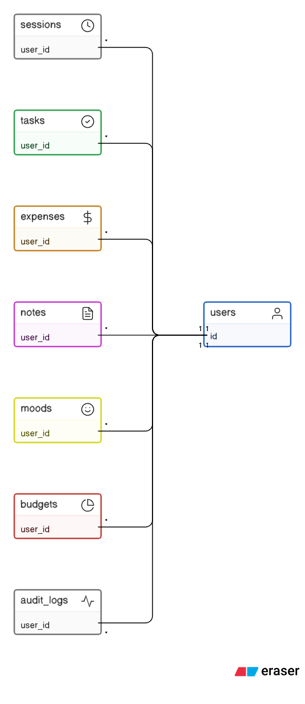
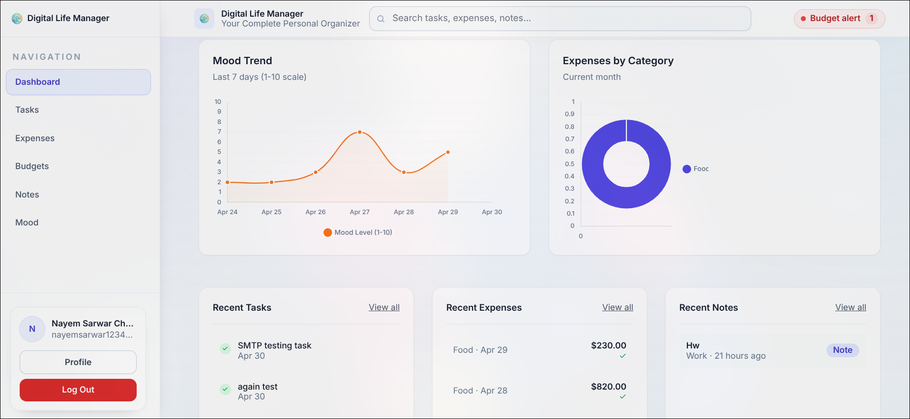
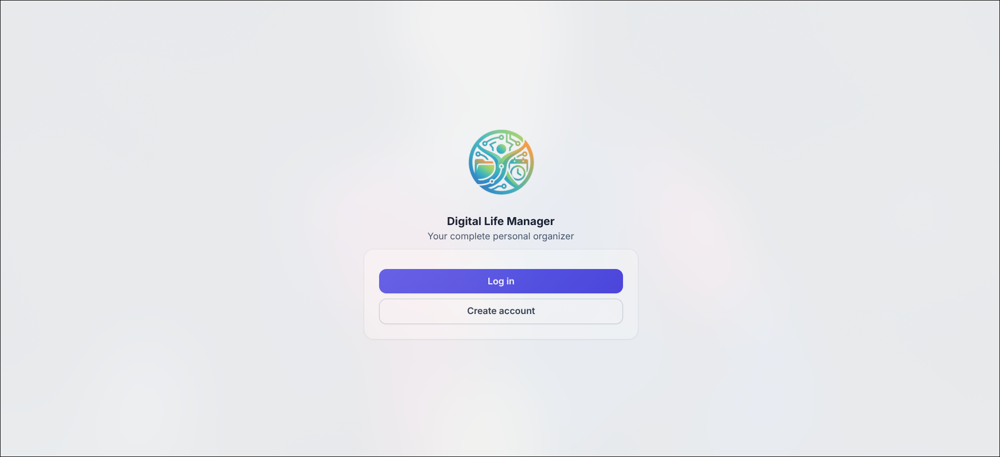
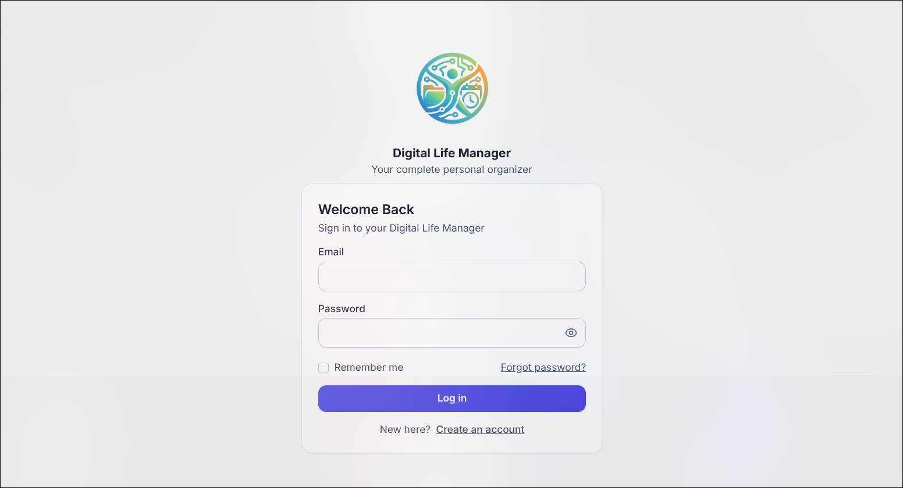
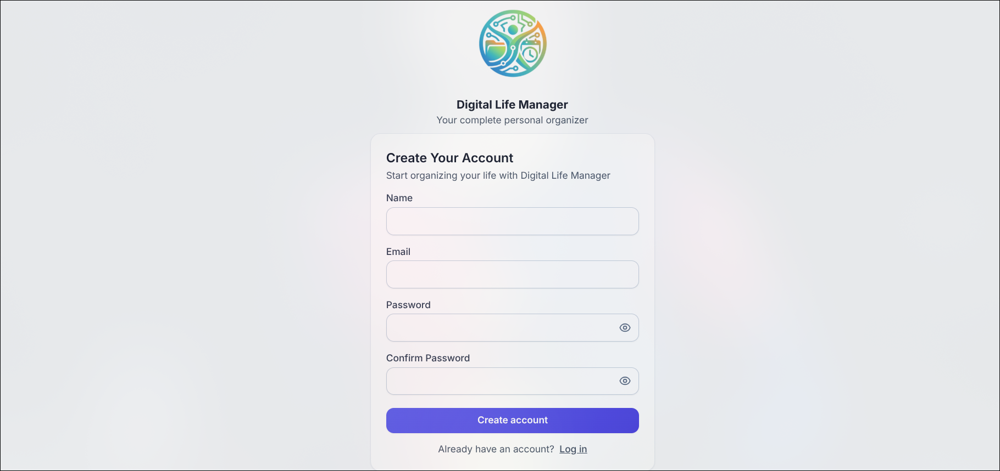
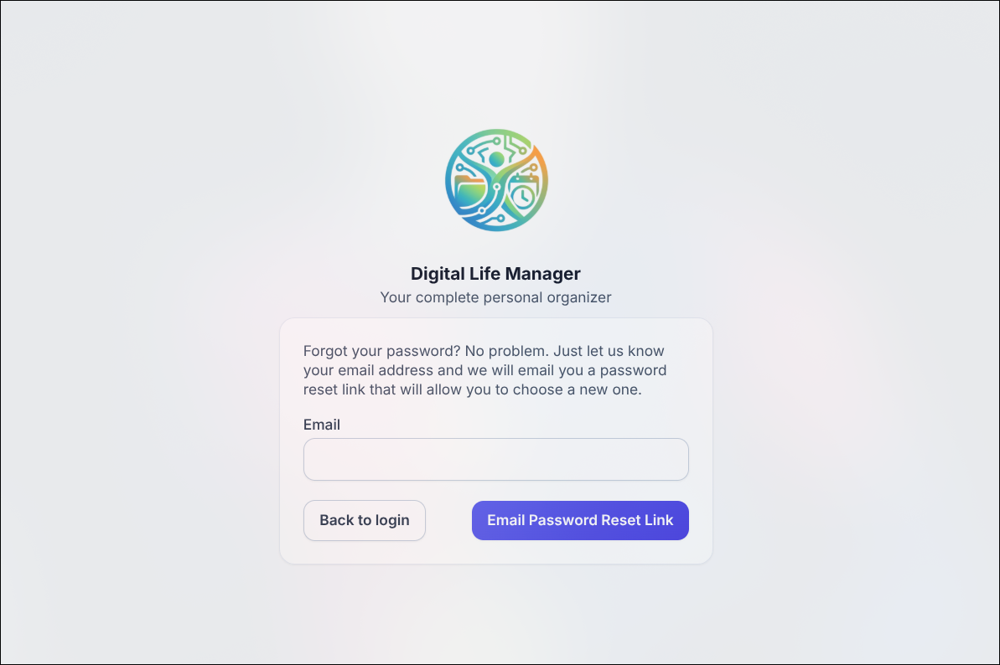
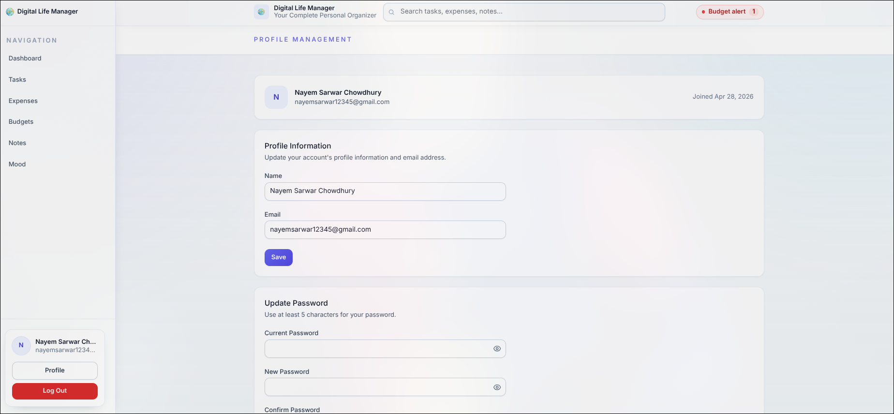

# Technical Documentation

## Overview

This document provides technical documentation for the Digital Life Manager Laravel application. It covers the technology stack, database schema and ER diagram, setup instructions, feature descriptions with screenshots, and a concise code walkthrough to help developers get started.

---

## Technology Stack

- **Backend:** PHP (Laravel)
- **Frontend:** Blade templates, Tailwind CSS, Vite, Alpine.js
- **Database:** MySQL (production/development), SQLite (optional for tests)
- **ORM / Migrations:** Eloquent, Laravel Migrations
- **Authentication / Email:** Laravel Auth scaffolding, Notifications, Mail (configurable via `MAIL_MAILER`)
- **Queues / Jobs:** Laravel queues (configured via `QUEUE_CONNECTION`)
- **Testing:** PHPUnit (php artisan test)
- **Build Tools:** Node.js, npm, Vite, PostCSS
- **Dev Tools:** Composer, Artisan, Tinker

---

## Database Schema

The application uses relational tables to store users, tasks, expenses, notes, moods, budgets, and audit logs. Below is a concise schema description derived from the migrations in `database/migrations`.

- `users`
	- `id` (PK, bigint)
	- `name` (string)
	- `email` (string, unique)
	- `email_verified_at` (timestamp, nullable)
	- `password` (string)
	- `remember_token` (string, nullable)
	- `created_at`, `updated_at` (timestamps)

- `password_reset_tokens`
	- `email` (PK, string)
	- `token` (string)
	- `created_at` (timestamp, nullable)

- `sessions` (session storage table)
	- `id` (PK, string)
	- `user_id` (FK -> `users.id`, nullable)
	- `ip_address` (string, nullable)
	- `user_agent` (text, nullable)
	- `payload` (longText)
	- `last_activity` (integer)

- `tasks`
	- `id` (PK)
	- `user_id` (FK -> `users.id`, cascade)
	- `title` (string)
	- `description` (longText, nullable)
	- `category` (string, nullable)
	- `priority` (enum: `low|medium|high|urgent`) default `medium`
	- `status` (enum: `not_started|in_progress|completed|archived|cancelled`) default `not_started`
	- `due_date` (datetime, nullable)
	- `completed_at` (timestamp, nullable)
	- `estimated_hours`, `actual_hours` (unsigned int, nullable)
	- `color_tag` (string, hex color)
	- `is_recurring` (boolean)
	- `recurrence_pattern` (string, nullable)
	- `tags` (json, nullable)
	- `created_at`, `updated_at`, `deleted_at` (timestamps, soft deletes)
	- Indexes: `user_id`, `status`, `due_date`, `priority`, `created_at`, fulltext on `title, description`.

- `expenses`
	- `id` (PK)
	- `user_id` (FK -> `users.id`, cascade)
	- `amount` (decimal(10,2))
	- `category` (string)
	- `description` (string, nullable)
	- `payment_method` (enum: `cash|card|check|bank_transfer|mobile_payment|other`) default `card`
	- `date` (date)
	- `receipt_url` (string, nullable)
	- `status` (enum: `pending|confirmed|disputed|refunded`) default `confirmed`
	- `tags` (json, nullable)
	- `budget_alert_sent` (boolean)
	- `created_at`, `updated_at`, `deleted_at` (timestamps, soft deletes)
	- Indexes: `user_id`, `category`, `date`, `amount`, `created_at`, composite (`user_id`, `date`).

- `notes`
	- `id` (PK)
	- `user_id` (FK -> `users.id`, cascade)
	- `title` (string)
	- `content` (longText)
	- `category` (string, nullable)
	- `color_tag` (string)
	- `is_pinned`, `is_archived` (booleans)
	- `tags`, `attachments`, `collaborator_ids` (json, nullable)
	- `permission_level` (enum: `private|shared|public`) default `private`
	- `word_count`, `reading_time` (unsigned int)
	- `created_at`, `updated_at`, `deleted_at` (timestamps, soft deletes)
	- Indexes: `user_id`, `is_pinned`, `is_archived`, `category`, `created_at`, `updated_at`, fulltext on `title, content`.

- `moods`
	- `id` (PK)
	- `user_id` (FK -> `users.id`, cascade)
	- `mood_level` (unsigned tiny int) // 1-10
	- `mood_label` (string, nullable)
	- `energy_level`, `stress_level`, `focus_level` (unsigned tiny int, nullable)
	- `emotion_tags` (json, nullable)
	- `notes` (text, nullable)
	- `activities` (json, nullable)
	- `sleep_hours` (decimal, nullable)
	- `weather`, `location` (string, nullable)
	- `recorded_date` (date)
	- `recorded_at` (timestamp)
	- `created_at`, `updated_at` (timestamps)
	- Indexes: `user_id`, `recorded_date`, `mood_level`, unique (`user_id`, `recorded_date`).

- `budgets`
	- `id` (PK)
	- `user_id` (FK -> `users.id`, cascade)
	- `category` (string)
	- `limit_amount` (decimal(10,2))
	- `month_year` (string, format `YYYY-MM`)
	- `spent_amount` (decimal(10,2))
	- `alert_threshold` (unsigned tiny int)
	- `is_active` (boolean)
	- `created_at`, `updated_at` (timestamps)
	- Indexes: `user_id`, `month_year`, unique(`user_id`, `category`, `month_year`).

- `audit_logs`
	- `id` (PK)
	- `user_id` (FK -> `users.id`, cascade)
	- `action` (string)
	- `entity_type` (string)
	- `entity_id` (unsignedBigInteger, nullable)
	- `old_values`, `new_values` (json, nullable)
	- `ip_address` (ipAddress, nullable)
	- `user_agent` (text, nullable)
	- `created_at` (timestamp)
	- Indexes: `user_id`, `action`, `created_at`, composite (`entity_type`, `entity_id`).

---

## ER Diagram

Refer to the ER diagram located in the repository: 



This diagram shows primary entities and foreign-key relationships (for example `tasks.user_id` -> `users.id`).

---

## Setup Instructions

Follow these steps to get the project running locally.

1. Clone the repository

```bash
git clone https://github.com/beingnayem/Digital-Life-Manager.git
cd Digital-Life-Manager
```

2. Install PHP dependencies

```bash
composer install
```

3. Install Node dependencies and build assets

```bash
npm install
npm run build   # or `npm run dev` for development
```

4. Create the database

- Create a MySQL database (e.g., `digital_life_manager`) and a database user with appropriate privileges.

5. Import the SQL schema (optional)

- The repository includes `schema.sql`. To import it:

```bash
mysql -u <db_user> -p <db_name> < schema.sql
```

6. Configure environment

- Copy `.env.example` to `.env` and update database settings and mail settings. Example values:

```
DB_CONNECTION=mysql
DB_HOST=127.0.0.1
DB_PORT=3306
DB_DATABASE=digital_life_manager
DB_USERNAME=your_db_user
DB_PASSWORD=your_db_password

# Local dev mailer
MAIL_MAILER=log
```

7. Generate application key and run migrations

```bash
php artisan key:generate
php artisan migrate
```

8. Run the application

```bash
php artisan serve --host=127.0.0.1 --port=8000
# Visit http://127.0.0.1:8000
```

Notes:
- If you prefer using SQLite for tests, ensure `pdo_sqlite` is installed and configured in PHP.
- The default local mailer is set to `log` to write emails to the application logs instead of delivering them. Change to SMTP/mailtrap if you need real delivery.

---

## Features Explained

This section describes the major features and what users can do.

### Authentication & User Management
- Register, verify email, login, logout, reset password. User sessions are stored via the configured session driver.

### Tasks / To-do
- Create and manage tasks with title, description, priority, status, due dates, recurrence, and time tracking. Tasks support soft deletes and full-text search.

### Notes
- Rich notes with attachments, tags, pin/archive, collaboration flags, and permission levels (private/shared/public).

### Expenses & Budgets
- Track expenses by category and payment method, store receipts, and define monthly budgets with alert thresholds.

### Moods / Journal
- Record mood entries with metrics (mood level, energy, sleep hours) and context tags to analyze trends.

### Audit Logs
- Capture user actions and data changes for accountability and debugging.

---

## User Guide (Screenshots)

Below are the main pages with screenshots and short descriptions.

- Dashboard


The primary dashboard provides an overview of tasks, recent notes, budget summaries, and quick actions. Users can navigate to detailed lists from dashboard widgets.



The second dashboard view showcases additional charts and widgets.

- Welcome / Landing



The public landing page with links to login and a brief product overview.

- Login



Standard login page. Supports forgotten password flows and redirects to the user dashboard after successful authentication.

- Create User / Registration



Registration form where new users provide name, email, and password. Email verification is sent (logged if `MAIL_MAILER=log`).

- Forgot Password



Request a password reset link by email.

- Tasks


Task list and create/edit UI. Users can filter by status, priority, date, and tags.

- Expenses


Expense listing and form to add receipts and categorize spending. Budget alerts are visible here.

- Budgets


Manage monthly budgets and view spent vs. limit.

- Moods


Record mood entries, view historical charts, and analyze trends.

- Profile



User profile page to update personal information and preferences.

---

## Code Walkthrough

Project is organized following Laravel conventions. Key folders and files:

- `app/Models/` — Eloquent models (`User.php`, `Task.php`, `Expense.php`, `Note.php`, `Mood.php`, `Budget.php`, `AuditLog.php`).
- `app/Http/Controllers/` — Controllers for auth and resource handling (look for `Auth` subfolder and resource controllers for tasks, notes, expenses).
- `app/Http/Requests/` — Form request validation classes (centralized validation logic).
- `database/migrations/` — Schema definitions (used above to compile the Database Schema section).
- `database/factories/` — Model factories used in tests and seeders.
- `resources/views/` — Blade templates (layouts at `resources/views/layouts`, auth at `resources/views/auth`, feature views under `resources/views/{tasks,notes,expenses,...}`).
- `resources/js/` and `resources/css/` — Frontend assets, bootstrapped by Vite.
- `routes/web.php` — Primary web routes and route groups.
- `phpunit.xml` — Test configuration; run `php artisan test` for feature/unit tests.

Important files:

- `artisan` — Laravel CLI tool.
- `schema.sql` — SQL schema snapshot (useful for quick imports).
- `.env.example` — Example environment variables.

---

## Maintenance Notes

- By default in development `MAIL_MAILER=log`, which writes outgoing emails to the application logs instead of delivering them. Change to `smtp` or a test SMTP provider (Mailtrap) for testing deliveries.
- Automated tests that rely on an in-memory SQLite database require the `pdo_sqlite` PHP extension; alternatively configure tests to run against a MySQL test database.

---

If you would like, I can also: run the test suite, enable SQLite in CI notes, or add a troubleshooting section for common local issues (CSRF 419, session drivers, mail configuration). Let me know which you'd prefer next.
