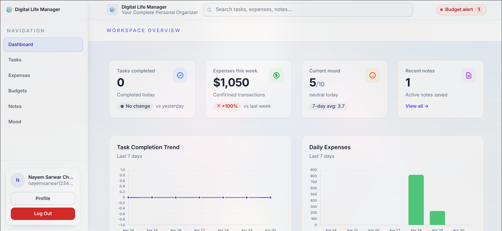
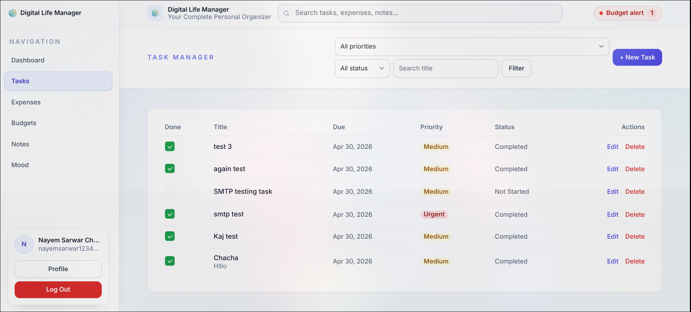
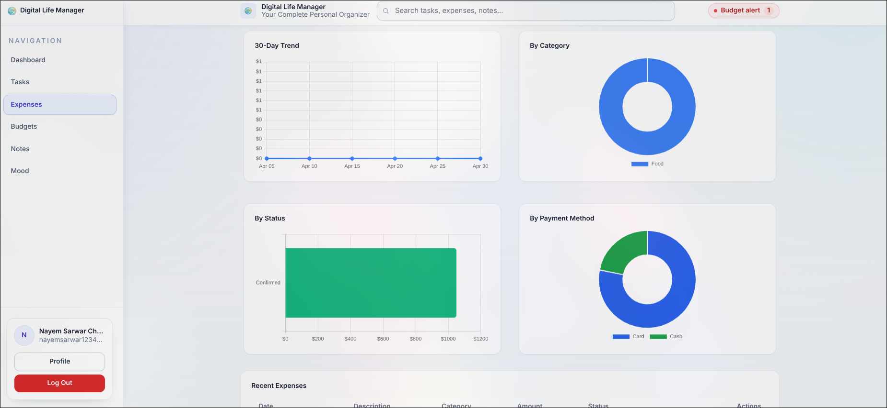
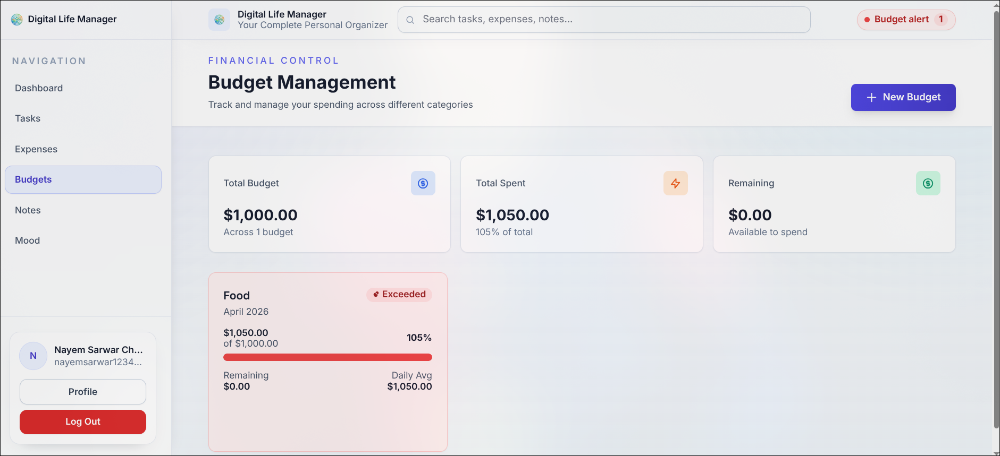
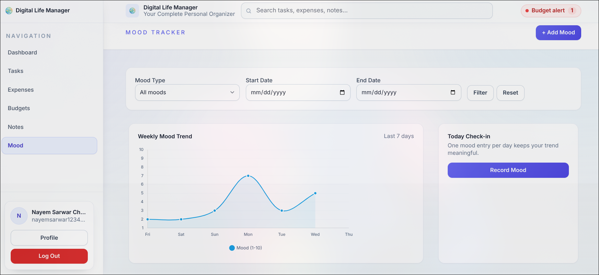

# Digital Life Manager

A modern Laravel-based web application to manage daily life efficiently — including tasks, notes, expenses, budgets, and mood tracking — all in one place.

---

## Tech Stack

- **Backend:** Laravel (PHP)
- **Frontend:** Blade, Tailwind CSS, Alpine.js, Vite
- **Database:** MySQL (primary), SQLite (testing)
- **ORM:** Eloquent
- **Authentication & Mail:** Laravel Auth, Notifications, Mail
- **Queues:** Laravel Queue System
- **Testing:** PHPUnit
- **Tooling:** Composer, npm, Artisan

---

## Features

- **Authentication** — Secure login, registration, password reset  
- **Tasks** — Task management with priority, status, deadlines  
- **Notes** — Rich notes with tags and organization  
- **Expenses** — Track spending with categories and receipts  
- **Budgets** — Monthly budget tracking with alerts  
- **Moods** — Daily mood tracking and insights  
- **Audit Logs** — Activity tracking system  

---

## Screenshots

### Dashboard


### Tasks Management


### Expenses Tracking


### Budget Overview


### Mood Tracking


---

## Installation

### 1. Clone the repository

```bash
git clone https://github.com/beingnayem/Digital-Life-Manager.git
cd Digital-Life-Manager
```

### 2. Install dependencies

```bash
composer install
npm install
```

### 3. Configure environment

```bash
cp .env.example .env
```

Update `.env`:

```
DB_DATABASE=digital_life_manager
DB_USERNAME=your_db_user
DB_PASSWORD=your_db_password
```

### 4. Generate key & migrate

```bash
php artisan key:generate
php artisan migrate
```

### 5. Build assets

```bash
npm run build
# or for development
npm run dev
```

### 6. Run the application

```bash
php artisan serve
```

Visit: http://127.0.0.1:8000

---

## Project Structure

```
app/
 ├── Models/
 ├── Http/Controllers/
 ├── Http/Requests/

database/
 ├── migrations/
 ├── factories/

resources/
 ├── views/
 ├── js/
 ├── css/

routes/
 └── web.php
```

---

## Testing

```bash
php artisan test
```

---

## License

This project is open-source and available under the MIT License.